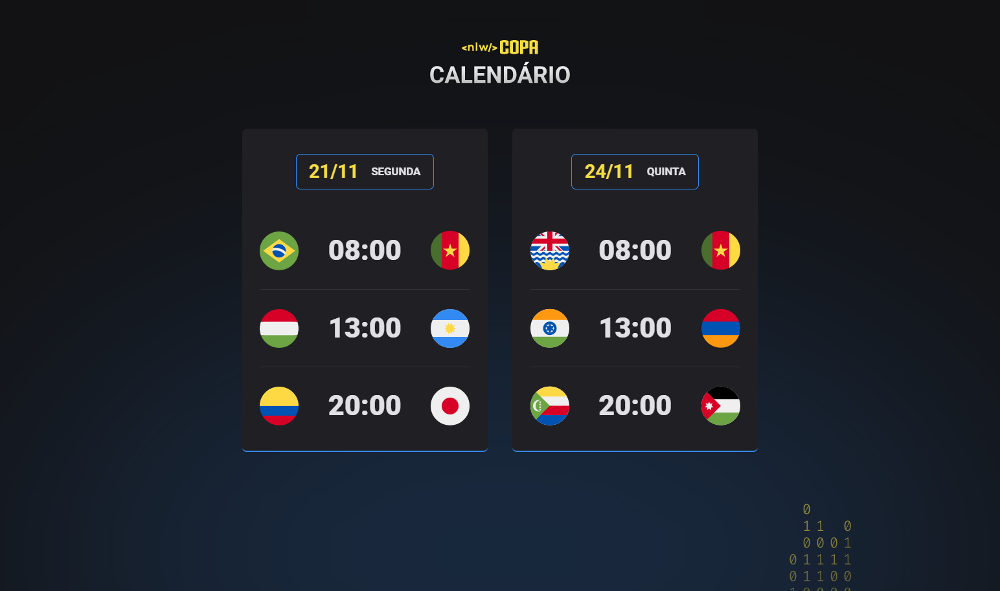
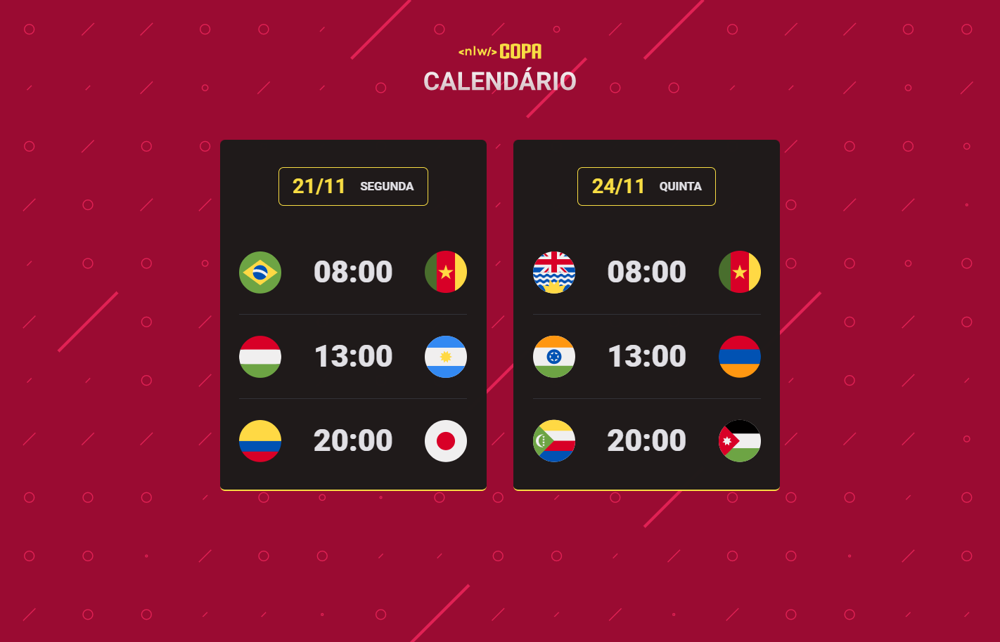

<h1 align="center"> NLW | Copa </h1>

Evento exclusivo e gratuito, promovido pela Rocketseat para ensino de tecnologias WEB.

  <a href="#-tecnologias">Tecnologias</a>&nbsp;&nbsp;&nbsp;|&nbsp;&nbsp;&nbsp;
  <a href="#-projeto">Projeto</a>&nbsp;&nbsp;&nbsp;|&nbsp;&nbsp;&nbsp;
  <a href="#-layout">Layout</a>&nbsp;&nbsp;&nbsp;|&nbsp;&nbsp;&nbsp;
  <a href="#memo-licença">Licença</a>

  

 

 Blue

  

---

 Yellow

  

---

 Green

  

---

 Red

  

---

## 🚀 Tecnologias

Esse projeto foi desenvolvido com as seguintes tecnologias:

- HTML e CSS
- JavaScript
- Git e Github

---

## 💻 Projeto

O Calendário da Copa é um projeto que mostra os jogos da Copa de 2022.

---

## 🔖 Layout

Você pode visualizar o layout do projeto através [DESSE LINK](<https://www.figma.com/file/mdSRGZjKIUAcPXFkK8w6Tf/Calend%C3%A1rio-de-Jogos-(Community)?node-id=301%3A1812>). É necessário ter conta no [Figma](https://figma.com) para acessá-lo.

---

## ✅ Licença

Esse projeto está sob a licença MIT.

---

 feito com ❤ por <a href="https://www.instagram.com/palomarodrigsb" target="_blank">@palomarodrigsb</a>

